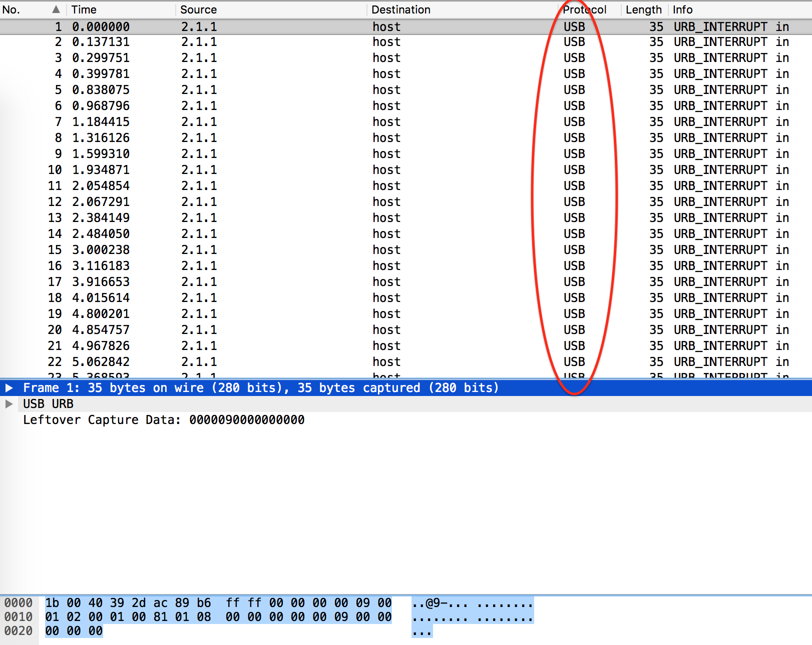
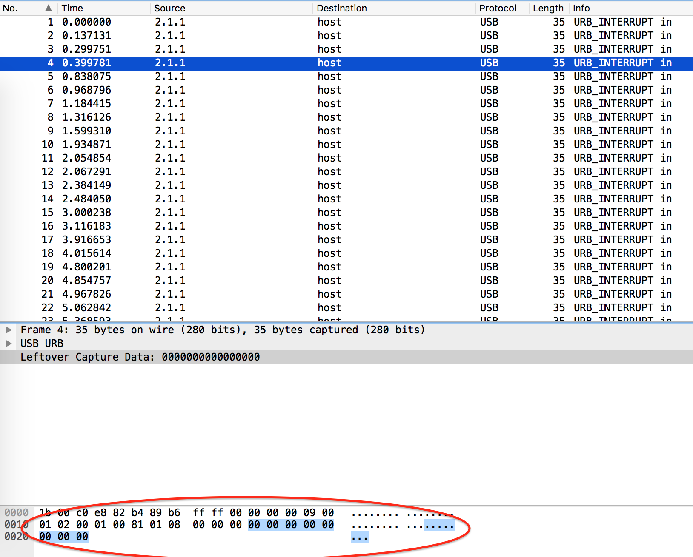
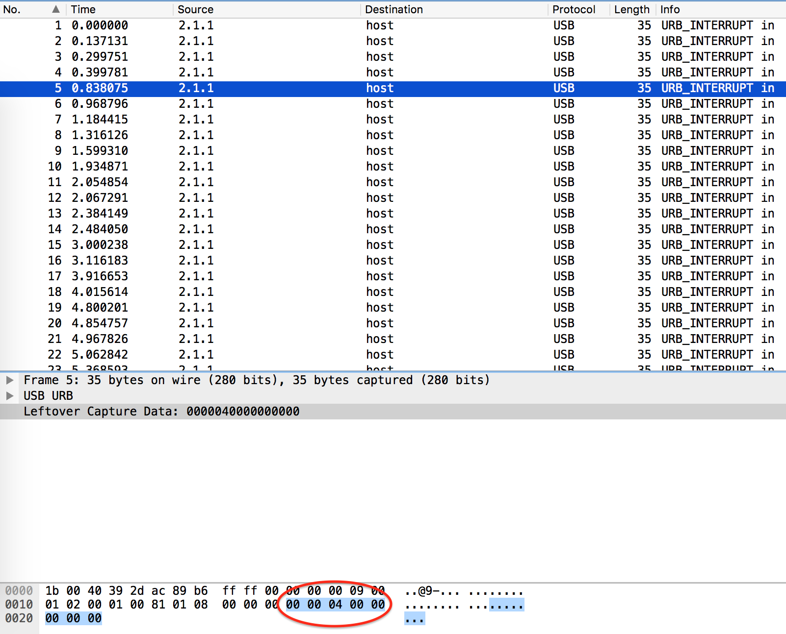

<H1>Just Keyp Trying</H1>

<B>Here's an interesting capture of some data. But what exactly is this data? Take a look: data.pcap</B>

>Hints:
>
>- Find out what kind of packets these are. What does the info column say in Wireshark/Cloudshark?
>- What changes between packets? What does that data look like?
>- Maybe take a look at http://www.usb.org/developers/hidpage/Hut1_12v2.pdf?

Lets open this pcap. 



Inside we see the USB protocol. At first glance there's not much here. However, as we scroll down we see some values change in the leftover captured data field (ignore the first few hex values, those are just the header data).




So lets extract this data. Going through one-by-one would be super tedious. Thankfully Wireshark can do this for us via the terminal:

```bash
tshark -r Just\ Keyp\ Trying.pcap -T fields -e usb.capdata 
	| awk -F: '{print $3}' | grep -v 00
```

Running this command will give us:

```
09
0f
04
0a
2f
13
15
20
22
22
2d
27
11
1a
04
15
07
16
2d
20
04
1e
27
1e
20
21
08
30
06
```
So what exactly are these values? Obviously they're hexadecimal, but its not ASCII. Perhaps they refer to something else? 

If we refer to the PDF document from page 53, we see a reference too all keyboard keys mapped to their hex values. Converting them will take time, we can write a script to make this easier for us:

```python
mappings = {
        0x04:"A", 0x05:"B", 0x06:"C", 0x07:"D", 0x08:"E", 0x09:"F",
        0x0A:"G", 0x0B:"H", 0x0C:"I", 0x0D:"J", 0x0E:"K", 0x0F:"L",
        0x10:"M", 0x11:"N", 0x12:"O", 0x13:"P", 0x14:"Q", 0x15:"R",
        0x16:"S", 0x17:"T", 0x18:"U", 0x19:"V", 0x1A:"W", 0x1B:"X",
        0x1C:"Y", 0x1D:"Z", 0x1E:"1", 0x1F:"2", 0x20:"3", 0x21:"4",
        0x22:"5", 0x23:"6", 0x24:"7", 0x25:"8", 0x26:"9", 0x27:"0",
        0x28:"\n",0x2C:" ", 0x2D:"_", 0x2E:"=", 0x2F:"{", 0x30:"}"
        }
 
nums = []
keys = open('Just Keyp Trying.txt')
for line in keys:
        nums.append(int(line.strip(),16))
keys.close()
 
output = ""
for n in nums:
        if n in mappings:
                output += mappings[n]
        else:
                output += 'x'
 
print 'output :' + output
```
Lets just create a text file containing the values to make our life easier still:

```bash
tshark -r Just\ Keyp\ Trying.pcap -T fields -e usb.capdata 
	| awk -F: '{print $3}' | grep -v 00 > Just\ Keyp\ Trying.txt
```
Running the python script gives us:

```
FLAG{PR355_0NWARDS_3A10134E}
```