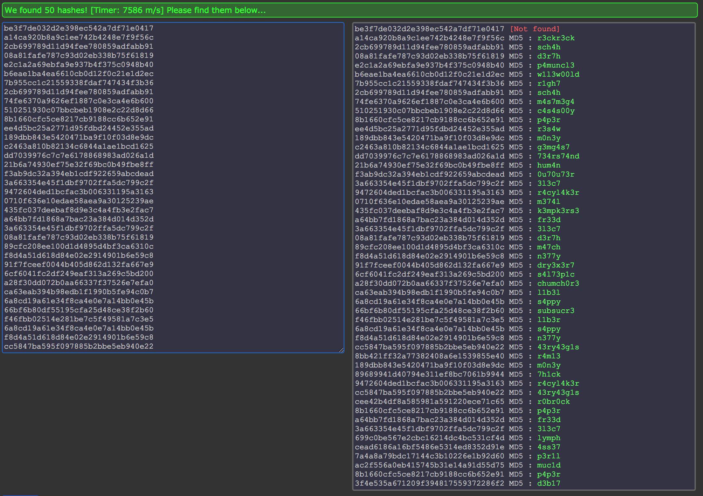

<H1>LeakedHashes</H1>
<B>Someone got hacked! Check out some service's password hashes that were leaked at hashdump.txt! Do you think they chose strong passwords? We should check... The service is running at shell2017.picoctf.com:44804!</B>

>Hints:
>
>See if you can crack any of the login credentials and then connect to the service as one of the users. What's the chance these hashes have actually already been broken by someone else? Are there websites that host those cracked hashes? Connect from the shell with nc.

The hashdump.txt file provides us with a lot of hashes. In order to decrypt them we should find out what type of hash they are, otherwise we could be in for a long wait to bruteforce them. Hash Identification (https://www.onlinehashcrack.com/hash-identification.php) provides us with a solution: We just copy one of the hashes and submit it to determine that the hashes are most likely MD5. So now we can try looking for a MD5 decrypter.

HashKiller (https://hashkiller.co.uk/md5-decrypter.aspx) is a good site to use. This site can accept multiple new-line separated hashes, so first we should isolate the hashes from the usernames in hashdump.txt:

```bash
cat hashdump.txt| awk -F: '{print $2}' > hashes.txt
```

Open the created hashes.txt file and copy all the hashes. We then can paste the copied hashes into HashKiller.

We get cracked hashes for all but the first hash:



The hashes submitted should be in the same order which they came from the hashdump.txt file, meaning the uncracked hash should belong to the root account. 

Anyways since we have cracked hashes lets connect to the server:

```bash
nc shell2017.picoctf.com 44804
```

By the looks of it, we could use any of these hashes, but for simplicity sake we will use the first available one:

```
username: christene
password: r3ckr3ck
```

```
welcome to shady file server. would you like to access the cat ascii art database? y/n
y

     /\_/\ 
    ( o o )
  G-==_Y_==-M
      `-'
      
  /\ /\ 
  (O o)
=(: ^ :)=  
  '*v*'
  
 |\_/|     
 (. .)
  =w= (\   
 / ^ \//   
(|| ||)
,""_""_ .

     /\_/\ 
    ( o o )
   -==_Y_==- 
      `-'
    /\**/\ 
   ( o_o  )_)
   ,(u  u  ,),
  {}{}{}{}{}{}
  
  /\_/\ 
 ( o.o )
  > ^ <
  
       /\_/\ 
  /\  / o o \ 
 //\ \~(*)~/
 `  \/   ^ /
    | \|| ||  
    \ '|| ||  
     \)()-())
     
   A_A
  (-.-)
   |-|   
  /   \  
 |     |  __
 |  || | |  \___
 \_||_/_/
 
     /\__/\ 
    /`    '\ 
  === 0  0 ===
    \  --  /    - flag is 3977df525282eaf0e99f86efd2b645ed

   /        \ 
  /          \ 
 |            |
  \  ||  ||  /
   \_oo__oo_/#######o
   
  /\___/\ 
 ( o   o )
 (  =^=  ) 
 (        )
 (         )
 (          )))))))))))
 
 /\ /\ 
 (O o)
=(:^:)=  
   U
   
    _,,/|
    \o o' 
    =_~_=
    /   \ (\ 
   (////_)//
   ~~~
   
   /\     /\ 
  {  `---'  }
  {  O   O  }  
~~|~   V   ~|~~  
   \  \|/  /   
    `-----'__
    /     \  `^\_
   {       }\ |\_\_   W
   |  \_/  |/ /  \_\_( )
    \__/  /(_E     \__/
      (  /
       MM
       
              ("`-''-/").___..--''"`-._
               `6_ 6  )   `-.  (     ).`-.__.`)
               (_Y_.)'  ._   )  `._ `. ``-..-'
             _..`--'_..-_/  /--'_.' ,'
           (il),-''  (li),'  ((!.-'
           
from http://user.xmission.com/~emailbox/ascii_cats.htm
```

We're presented with cats and our flag:

```
flag is 3977df525282eaf0e99f86efd2b645ed
```