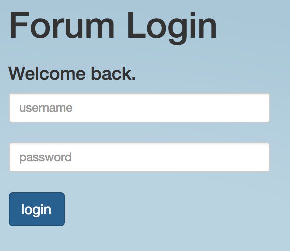
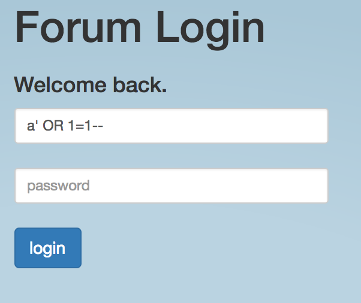
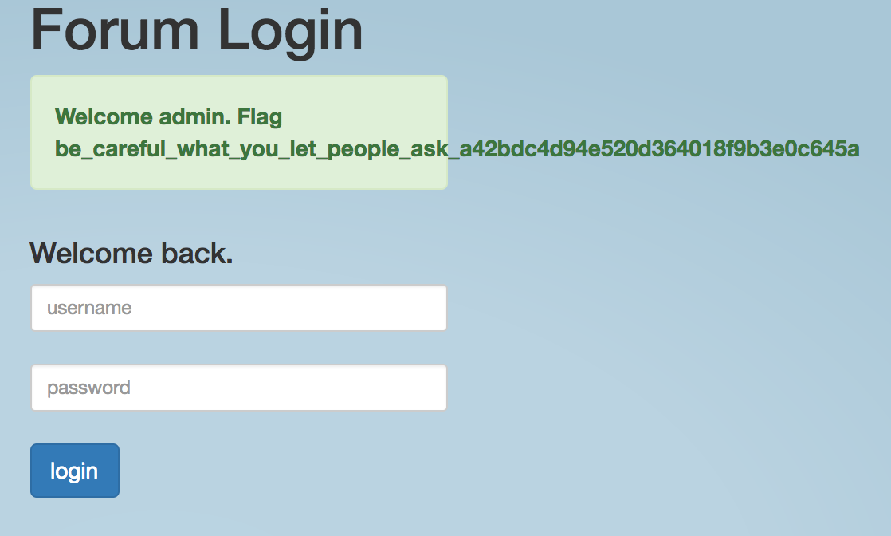

<H1>My First SQL</H1>
<B>I really need access to website, but I forgot my password and there is no reset. Can you help?</B>

>Hints:
>
>Have you heard about SQL injection?

SQL injection. Classic. First step is to determine what the escape character is. The most common escape characters are `'` and `"`. All we need to do is insert the escape character into an input field and see what happens when we submit it:




So we can see `'` can be used as the escape character here. So now for the injection. 

The goal here is to complete the SQL query we see in a valid manner, insert what we want to do and then begin a comment to negate the rest of the back-end code. Lets create a query to do just that:

```SQL
a' OR 1=1 --
```

So here we have a query here where we just finish the field query with a, negate it with an OR operator, insert 1=1 to make the entire statement true, then comment out whatever follows afterward.

Now to use it:



Submitting it gets us our flag:

