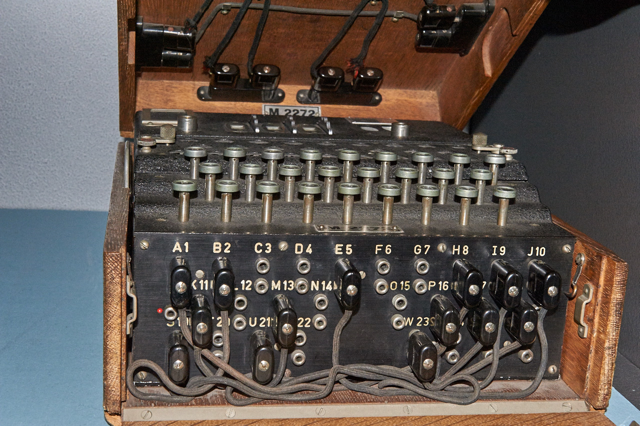
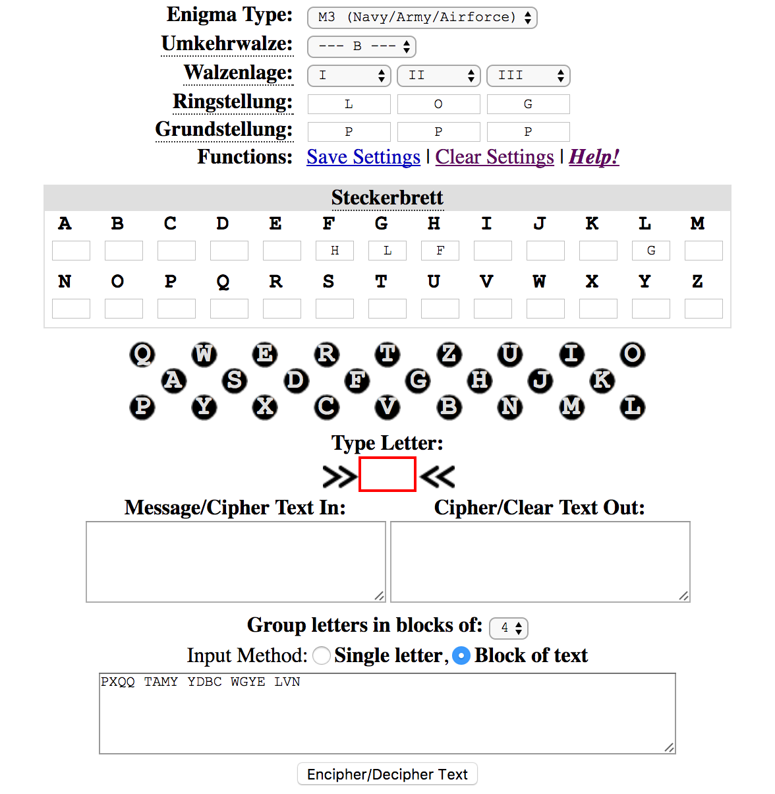

<H1>Mystery Box</H1>
<B>You've found a mystery machine with a sticky note attached to it! Oh, there's also this picture of the machine you found.</B>

>Hints:
>
>- It really gets your gears Turing.
>- I hear there's something Naval about it.

We're given the following information and image:

```
Geheimnis: PXQQ TAMY YDBC WGYE LVN
Umkehrwalze: B
Grundstellung: PPP
Ringstellung: LOG
Steckerbrett: G-L, H-F
```



The fact that the clues are written in German tells me this is for an Enigma Machine (https://en.wikipedia.org/wiki/Enigma_machine). If you do not know what this is, read up on it to learn something interesting about World War II. The hints about gears, Turing (most likely Alan Turing) and naval (U-Boats) just seals the deal for me.

Anyways with this information we can just search for an online decipher tool for the Enigma Machine. Enigma (http://enigma.louisedade.co.uk/enigma.html) has always been a good tool for me so I shall continue using it.

We just enter the information given like so:



We get our flag:

```
QUIT EPUZ ZLIN GIND EED
```

However, submitting it like so will not work. Closer inspection reveals words. Lets just remove the spaces:

```
QUITEPUZZLINGINDEED
```