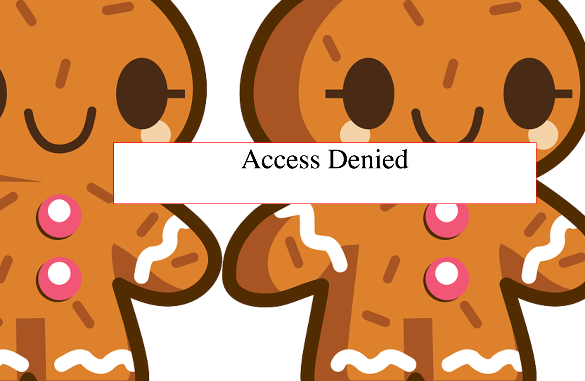
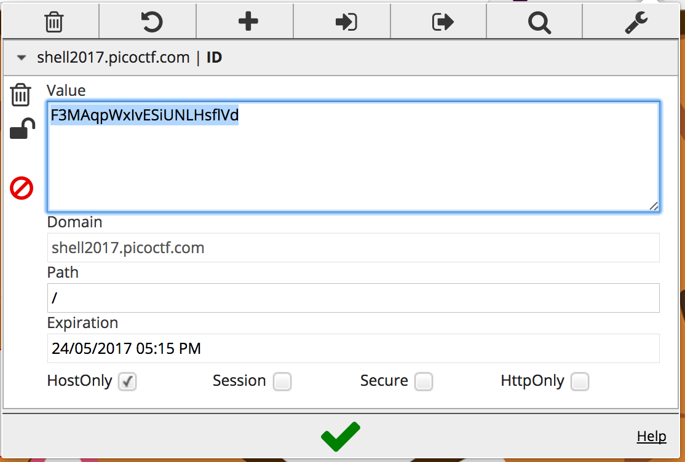
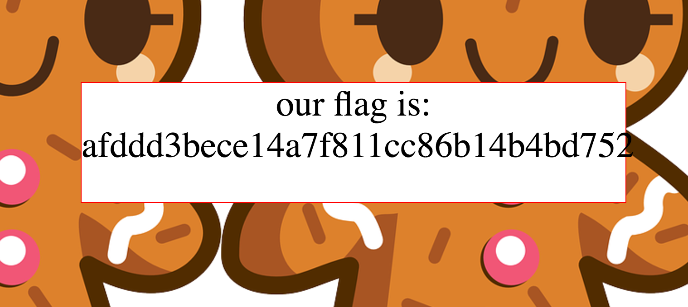

<H1>Biscuit</H1>
<B>Your friend has a personal website. Fortunately for you, he is a bit of a noob when it comes to hosting a website. Can you find out what he is hiding? Website.</B>

>Hints:
>
>Viewing the source of the website is usually a good start.

Clicking the link to the website brings us to http://shell2017.picoctf.com:19997/. We're presented with a webpage with "Access Denied" and ginger-breadman background.



Not really anything we can do here, so lets inspect the source.

```html
<html>

<!-- Storing stuff in the same directory as your web server doesn't seem like a good idea -->
<!-- Thankfully, we use a hidden one that is super PRIVATE, to protect our cookies.sqlite file -->
<style>
body{
	background-image: url("private/image.png");
}
</style>

<body >

<div style='background:white;margin: auto;border: 1px solid red;width: 600px; margin-top: 20%;' >
<center>
<form style="font-size: 40px; ">
Access Denied</form>
</center>
</div>

</body>

</html>
```

In the comments we can see that the webpage developer has stored the site's cookies.sqlite file on the webserver. Lets see if we can access it:

```http
http://shell2017.picoctf.com:19997/cookies.sqlite
```

We are given a "Not Found" error, so no luck here. Apparently the cookie file is hidden in a super PRIVATE location, so lets try:

```http
http://shell2017.picoctf.com:19997/private/cookies.sqlite
```

Bingo. We have the cookies.sqlite file. So what can we do with this thing? Cookies often store session IDs so perhaps we can pull one out and hijack the session.

We begin with looking at the data stored in the cookie file:

```bash
sqlite3 cookies.sqlite
```
With a bit of Googling, we find that cookies.sqlite files are often generated by Mozilla Firefox and that it should contain a table called "moz_cookies". We can confirm this by running:

```sql
.tables
```

Lets try reading this table:

```sql
SELECT * FROM moz_cookies;
```

We're presented with the following information.
`
1|localhost|0|0|ID|F3MAqpWxIvESiUNLHsflVd|localhost|/|1489365457|1489279130600290|1489279057101857|0|0
`
But what do these values relate to? We can determine the table schema by running:

```sql
.schema moz_cookies
```
`CREATE TABLE moz_cookies (id INTEGER PRIMARY KEY, baseDomain TEXT, appId INTEGER DEFAULT 0, inBrowserElement INTEGER DEFAULT 0, name TEXT, value TEXT, host TEXT, path TEXT, expiry INTEGER, lastAccessed INTEGER, creationTime INTEGER, isSecure INTEGER, isHttpOnly INTEGER, CONSTRAINT moz_uniqueid UNIQUE (name, host, path, appId, inBrowserElement));
CREATE INDEX moz_basedomain ON moz_cookies (baseDomain, appId, inBrowserElement);
`

Turns out the only field of interest to us is the "value" field, this should be the session ID. So now that we (assumingly) have the session ID our next step is to use it to hijack a session. We can use a Chrome extension: EditThisCookie (http://www.editthiscookie.com/), to do it for us. So lets load up the website again and insert this value in:



Now we just have to refresh the page to get in.



We now have our flag.