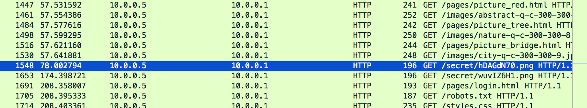
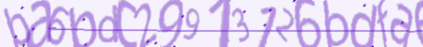

<h1>Puzzlingly Accountable</h1>
<B>We need to find a password. It's likely that the updated passwords were sent over the network. Let's see if that's true: data.pcap. Update 16:26 EST 1 Apr If you feel that you are close, make a private piazza post with what you have, and an admin will help out. The ones and sevens unfortunately look like each other.</B>

>Hints:
>
>How does an image end up on your computer? What type of packets are involved?

The pcap contains a lot of HTTP and TCP traffic. We need a way to filter it down. The hint asks us how an image can get on to our computer. Considering the type of packets (traffic) involved we expect this to be done via a HTTP GET request, so lets filter them out:

```
http.request.method == GET
```
Applying the filter presents us with a lot of GET requests on images. However, there aren't too many so we can just scroll through. At some point we find two PNG images being requested from /secret instead form the stock standard /images.



Lets mark them and filter by their respective HTTP streams. We'll start with hDAGdN70.png. Following the HTTP stream of this GET request gives us the following filter:

```
tcp.stream eq 99
```
So what we'r interested in is the data that makes up the PNG image. Unfortunately it's fragmented. We can use the tshark command line to do the brute work for us:

```bash
tshark -r Puzzlingly\ Accountable.pcap -Y "tcp.stream eq 99" -Tfields -e data > puzzle1
```
Since we know there are two images to download, we will first collect the first set of data and store it in "puzzle1". Let's see what we have:

```
file puzzle1
puzzle1: ASCII text, with very long lines
```
So our hexadecimal data for a PNG image is read as ASCII...reading the file reveals why:

```
cat puzzle1
```
The output from the cat query shows us that the file contains nothing but numbers (we have exported the results in raw form) and a lot of new line operators (`\n`). Conveniently, we see that the first few numbers reflect the interpreted hexadecimal values of a PNG image header. Now we need to deal with the new line operators by removing them:

```bash
 cat puzzle1 | tr -d '\n' > puzzle1_2
```

Now the file should just be a ASCII text file with no new lines. Since we want a PNG image we will need to convert the file back into hexadecimal:

```bash
xxd -r -p puzzle1_2 puzzle1.png
```
Viewing the image gives us the first part of our flag:



Repeating the same process for the second image gives us the second part:


```
ba6bdc29913126bdfae1487324d2e077
```